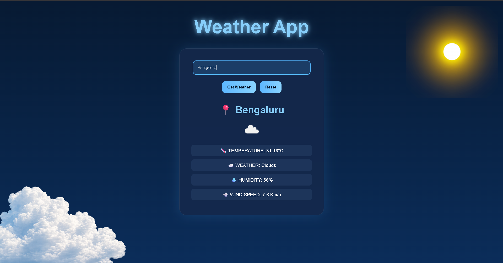

# 🌦️ Weather App

A stylish weather application built using **HTML, CSS, and JavaScript** with **OpenWeather API** integration to fetch real-time weather information.

## 🚀 Features

* 🌡️ Real-time temperature
* ☁️ Weather condition
* 💧 Humidity
* 💨 Wind speed
* 🎯 Weather icons from API
* ⌨️ Enter key support
* 🔄 Reset button
* ⎋ Escape key reset
* 🎨 Modern weather-themed UI


## 🛠️ Tech Stack

* HTML
* CSS
* JavaScript
* OpenWeather API

## 📸 Preview





## ⚙️ How to Run

1. Clone the repository

```bash
git clone https://github.com/your-username/weather-app.git
```

2. Open the project folder

3. Add your OpenWeather API key in `config.js`

4. Run `index.html`

## 📚 What I Learned

This project helped me understand:

* APIs
* `fetch()`
* JSON data handling
* Async JavaScript basics
* Error handling
* DOM manipulation

---

Built as part of my **Full Stack + AI/ML learning journey 🚀**
